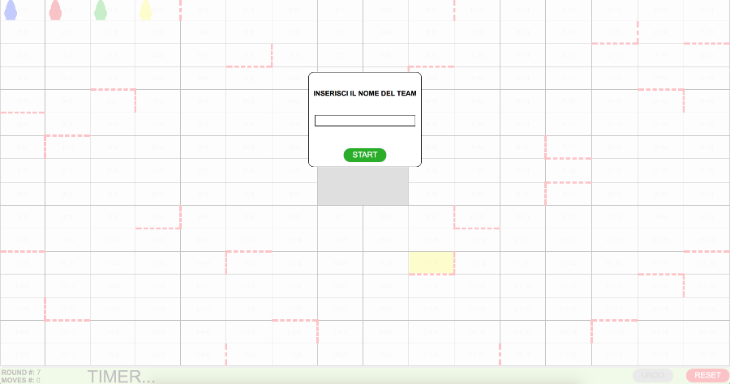
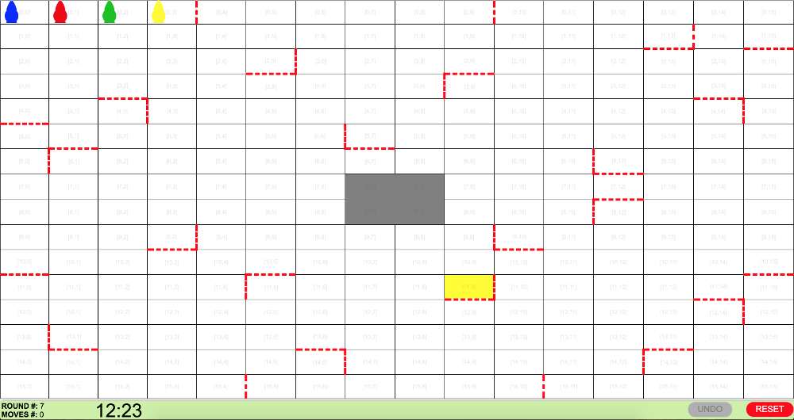

# Ricochet Robots Project for MakeFaire 2017 #

## Introduction ##
The project aims to simulate the Ricochet Robots game in to a webpage.
The game can be played by multiple users at the time. The first user that insert the group name starts the countdown timer, the other users that will connect after, will have the timer set to the same value of the first user.

The destination cell of the game and the color change eachtime a group reach it and win the round, otherwise the game maintain the same.

For the Makefaire i have also added all the necessary functionality to move the real robot with the rest api exposed by the arduino yun.
## Screenshot ##

### WEBPAGE ###
On game open:



On running round:



On selected robot:


## CONSOLE COMMAND ##

I have add for testing or other purpose some extra command to run in the webbrowser console.

### Random simulation ###

To let me test all the possible special cases i have created a game simulator.
The simulator choose randomly the robot and the movement. 
If the simulator found an unsafe situation stop the simulation and return the robot and the position that is wrong.

```
gen.runSimulation(<NUM_MOVES>)
//<NUM_MOVES> = represent the number of random moves to do

//es.
gen.runSimulation(10)
//run 10 random move
```

### Read optimal solution ###

Simulate the excution of the optimal solution, pre-evaluated.
```
fm.readJSONFromGiuseppeP()
```
This command read the file jsonConfiguration/optimal.json and simulate the movements the robots as described in the file.

### Read optimal solution and move the LEGO robot ###

For the makefaire 2017 I build this web game and others guy build the LEGO robots connected with the arduino YUN.

```
fm.readJSONFromGiuseppeP_SIMULAZIONE_ROBOT()
```

### CLEAN ALL ###

This command clean all generated files in the game to reset it to the initial state

```
gen.cleanAll()
```