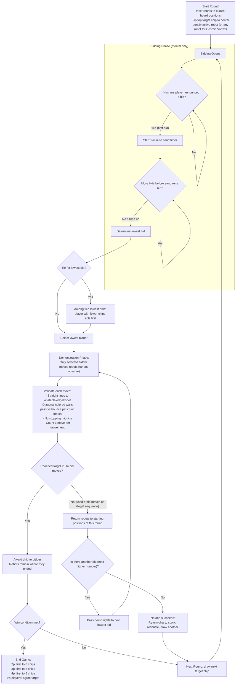

```mermaid

flowchart TD
  %% Ricochet Robots — Round Flow (VS Code safe: ASCII only, quoted labels, <br/> line breaks)

  A["Start Round<br/>Reset robots to current board positions<br/>Flip top target chip to center<br/>Identify active robot (or any robot for Cosmic Vortex)"] --> B["Bidding Opens"]

  subgraph B1["Bidding Phase (mental only)"]
    B --> C{"Has any player announced a bid?"}
    C -- "No" --> C
    C -- "Yes (first bid)" --> T["Start 1-minute sand timer"]
    T --> D{"More bids before sand runs out?"}
    D -- "Yes" --> D
    D -- "No / Time up" --> E["Determine lowest bid"]
  end

  E --> F{"Tie for lowest bid?"}
  F -- "No" --> G["Select lowest bidder"]
  F -- "Yes" --> H["Among tied lowest bids: player with fewer chips acts first"]
  H --> G

  G --> I["Demonstration Phase:<br/>Only selected bidder moves robots (others observe)"]
  I --> J["Validate each move:<br/>- Straight lines to obstacle/edge/robot<br/>- Diagonal colored walls: pass vs bounce per color match<br/>- No stopping mid-line<br/>- Count 1 move per movement"]
  J --> K{"Reached target in <= bid moves?"}

  K -- "Yes" --> L["Award chip to bidder<br/>Robots remain where they ended"]
  L --> M{"Win condition met?"}
  M -- "Yes" --> N["End Game:<br/>2p: first to 8 chips<br/>3p: first to 6 chips<br/>4p: first to 5 chips<br/>>4 players: agree target"]
  M -- "No" --> O["Next Round: draw next target chip"]

  K -- "No (used > bid moves or illegal sequence)" --> P["Return robots to starting positions of this round"]
  P --> Q{"Is there another bid (next higher number)?"}
  Q -- "Yes" --> R["Pass demo rights to next lowest bid"]
  R --> I
  Q -- "No" --> S["No one succeeds:<br/>Return chip to stack, reshuffle, draw another"]
  S --> O

  O --> B

```
